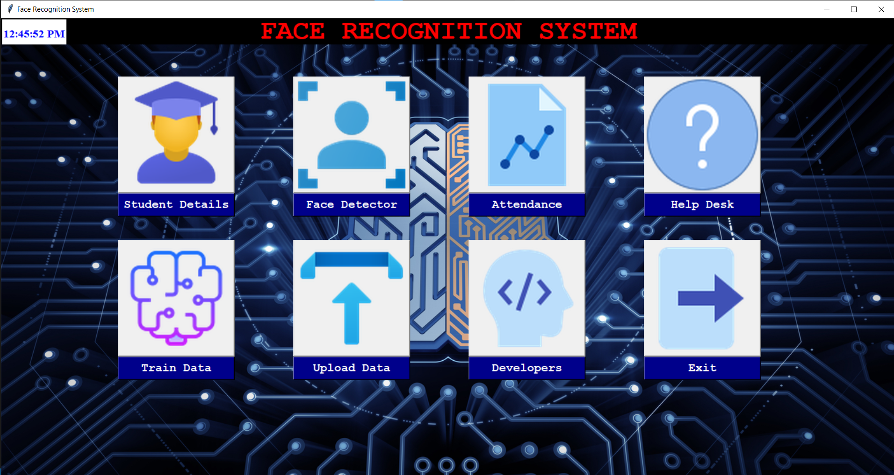
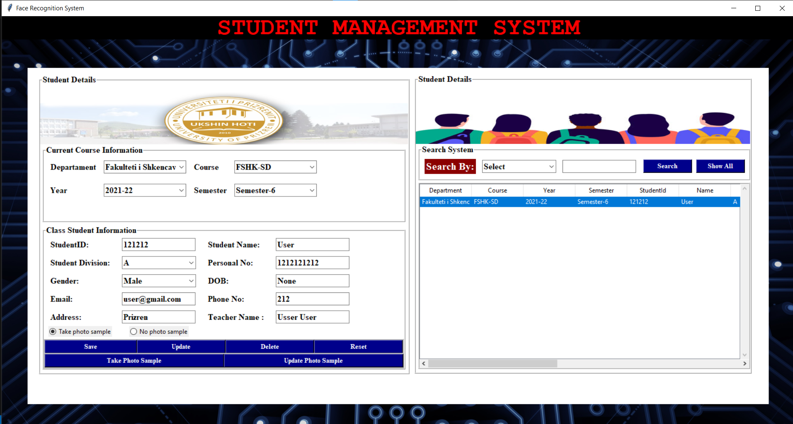
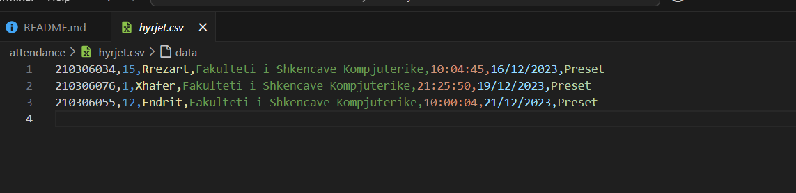

# Faculty Project

This project focuses on using AI to manage student attendance. First, students are registered in a MySQL database, where their information is securely stored. After registration, a dataset of student photos is generated.

Once the dataset is prepared, we train a facial recognition model using the LBPH (Local Binary Patterns Histograms) algorithm. This model can identify registered students and automatically log their attendance in a CSV file.

The system ensures accurate and efficient attendance tracking through facial recognition technology.